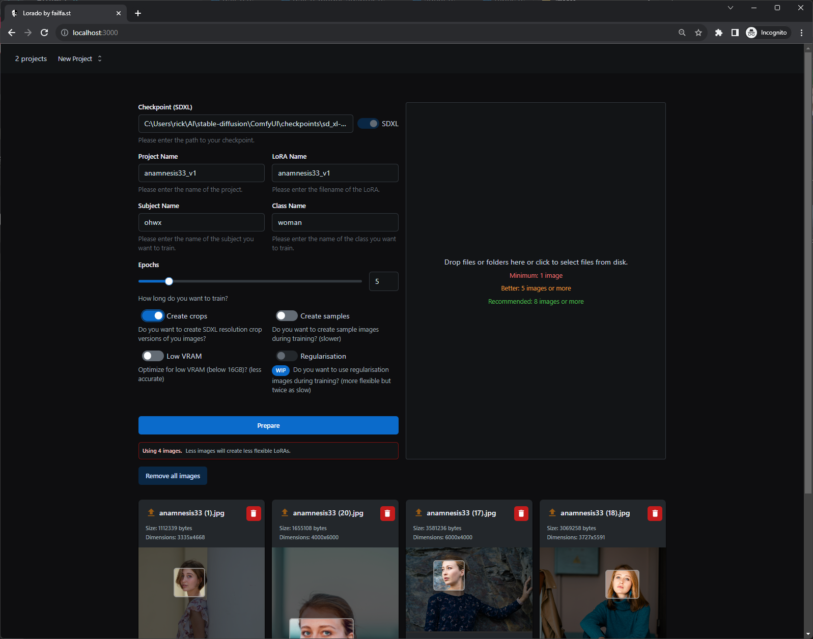
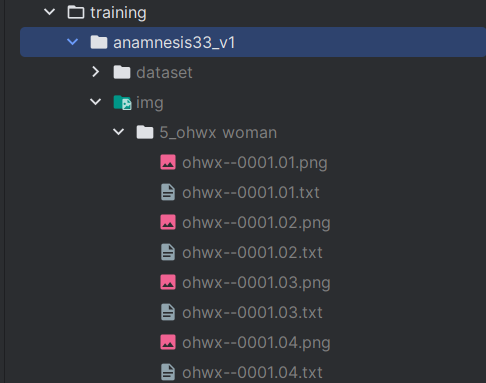

# LoRAdo

[](https://discord.com/invite/m3TBB9XEkb)

Prepare datasets for [Kohya_ss](https://github.com/bmaltais/kohya_ss/) (a GUI for https://github.com/kohya-ss/sd-scripts.)

> We plan to integrate training directly into this tool

Welcome to LoRAdo. This toolkit is designed to streamline the process of LoRAs image generation. Suitable for both beginners and experienced developers, it simplifies dataset creation. Initially designed with portraits in mind, LoRAdo is adaptable and works well for various subjects. Key features include face detection and user-friendly cropping tools, ensuring a practical balance between user experience and results.

With LoRAdo, creating datasets for image training is straightforward and efficient.

**Screenshots**

<figure align="center">

<figcaption>The user interface</figcaption>
</figure>
<figure align="center">

<figcaption>The prpared folder</figcaption>
</figure>

 
## Getting Started with LoRAdo 🚀

1. **Prerequisites:**

   - Ensure you have `node.js (v18+)` installed. If not, you can download it from [Node.js official site](https://nodejs.org/).

2. **Clone and Install Dependencies:**

   ```bash
   git clone https://github.com/failfa-st/LoRAdo.git
   cd LoRAdo
   npm install
   ```

3. **Running the App:**

   ```bash
   npm run build
   npm run start
   ```

   Your app should now be running on [http://localhost:3000](http://localhost:3000). Navigate to this URL in your browser to explore the LoRAdo UI.

4. **Using LoRAdo:**

   - **Step 1:** Upload your desired image or images.
   - **Step 2:** Utilize the in-built face detection for quick crops or adjust as per your requirements.
   - **Step 3:** With a single click, transform your images into a ready-to-use dataset for [Kohya_ss](https://github.com/bmaltais/kohya_ss/)!

5. **Feedback and Support:**
   Encountered an issue or have a suggestion? Join our [Discord community](https://discord.com/invite/m3TBB9XEkb) or open an issue on GitHub. We'd love to hear from you!

---


Example images via [@anamnesis33](https://unsplash.com/@anamnesis33)

| Image                                                                                                            | Link                                    |
|------------------------------------------------------------------------------------------------------------------| --------------------------------------- |
| [](public/images/anamnesis33/example%20(1).jpg) | https://unsplash.com/photos/mqcYKihgfAo |
| [](public/images/anamnesis33/example%20(2).jpg) | https://unsplash.com/photos/06TuQM7RSP4 |
| [](public/images/anamnesis33/example%20(3).jpg) | https://unsplash.com/photos/AUJhl146mBY |
| [](public/images/anamnesis33/example%20(4).jpg) | https://unsplash.com/photos/8OWttYqN47I |
