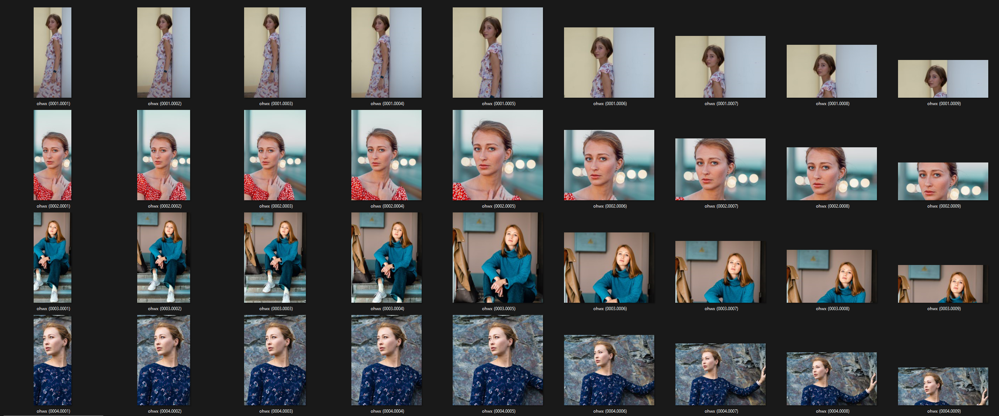

# LoRAdo

[](https://discord.com/invite/m3TBB9XEkb)

Prepare datasets for [Kohya_ss](https://github.com/bmaltais/kohya_ss/) (a UI for
https://github.com/kohya-ss/sd-scripts.)

> We plan to integrate training directly into this tool

<!-- toc -->

-   [Intro](#intro)
-   [Why?](#why)
-   [Screenshots](#screenshots)
-   [Features](#features)
-   [Getting Started with LoRAdo](#getting-started-with-lorado)
-   [Using LoRAdo](#using-lorado)
-   [How LoRAdo Works](#how-lorado-works)
-   [Generation examples](#generation-examples)

<!-- tocstop -->

## Intro

Welcome to LoRAdo. This toolkit is designed to streamline the process of LoRAs image generation.
Suitable for both beginners and experienced developers, it simplifies dataset creation. Initially
designed with portraits in mind, LoRAdo is adaptable and works well for various subjects. Key
features include face detection and user-friendly cropping tools, ensuring a practical balance
between user experience and results.

With LoRAdo, creating datasets for image training is straightforward and efficient.

## Why?

We wanted to provide an easy way to train LoRAs for different use cases. During research, we decided
to build a few small helper functions to help us gather images and crop them as well as create
caption files. This UI offers an easy way to create LoRAs without overthinking it.

## Screenshots

<table>
<tr>
<td align="center">

<br/>
The user interface
</td>

<td align="center">

<br/>
View and  configure images
</td>
</tr>
<tr>
<td align="center">

<br/>
The prepared folder
</td>

<td align="center">

<br/>
The cropped images
</td>
</tr>
</table>

## Features

-   Dataset creation
-   Captioning tools
-   SDXL resolution adjustment
-   Multiple image resolutions
-   [Kohya_ss (UI)](https://github.com/bmaltais/kohya_ss/) config creator
-   Regularisation image tools (WIP)

## Getting Started with LoRAdo

1. **Prerequisites:**

    - Ensure you have `node.js (v18+)` installed. If not, you can download it from
      [Node.js official site](https://nodejs.org/).

2. **Clone and Install Dependencies:**

    ```bash
    git clone https://github.com/failfa-st/LoRAdo.git
    cd LoRAdo
    npm install
    ```

3. **Running the App:**

    ```bash
    npm run build
    npm run start
    ```

    Your app should now be running on [http://localhost:3000](http://localhost:3000). Navigate to
    this URL in your browser to explore the LoRAdo UI.


## Using LoRAdo

1. **Step 1:** Begin by uploading your chosen image(s).
2. **Step 2:** Let LoRAdo's face detection feature scan the image.
    - If a face is detected, the system identifies it as a potential focal point for cropping.
    - If no face is detected, evaluate if the image is suitable for your needs.
3. **Step 3:** Add captions to your images directly within the app, enhancing the context and meaning of each.
4. **Step 4:** Choose your cropping method:
    - Opt for minimal cropping by finding the best-fitting SDXL resolution based on the original aspect ratio, while still considering the detected focal point.
    - Or, generate 9 SDXL compatible crops for each image.
5. **Step 5:** With a single click, transform your curated images into a dataset tailor-made for [Kohya_ss](https://github.com/bmaltais/kohya_ss/).
6. **Step 6:** Navigate to the [training folder](training):
    - Every dataset here comes with its own `config.json` file.
    - These configurations are primed for integration into Kohya_ss.

## How LoRAdo Works

At the heart of LoRAdo is the intent to simplify the complex.

1. **Image Optimization:** Start with any image. LoRAdo smartly crops it to fit the ideal SDXL
   resolution. For images with faces, they become the focal point, ensuring the best visual result.
   Without a face? No worries, we center-crop it perfectly.

2. **Multiple Resolutions:** Beyond the default, you have the option to generate images in all 9
   SDXL resolutions, as an attempt to increase flexibility without compromising on quality.

3. **Configuration Made Easy:** LoRAdo generates a configuration file tailored for Kohya_ss. Once
   your project is set, integrating it with Kohya_ss is a breeze. Simply load the config under the
   LoRA tab, and you're all set to begin training. And if you wish, Kohya_ss offers more granular
   configuration options.

While our approach is guided by a strong opinion on usability, it still leaves room for
customization. As we evolve, expect enhanced configurability. But rest assured, simplicity will
always be our guiding star, ensuring that interacting with LoRAdo remains intuitive.

Example images via [@anamnesis33](https://unsplash.com/@anamnesis33)

| Image                                                                                                              | Link                                    |
| ------------------------------------------------------------------------------------------------------------------ | --------------------------------------- |
| [](<public/images/anamnesis33/example%20(1).jpg>) | https://unsplash.com/photos/mqcYKihgfAo |
| [](<public/images/anamnesis33/example%20(2).jpg>) | https://unsplash.com/photos/06TuQM7RSP4 |
| [](<public/images/anamnesis33/example%20(3).jpg>) | https://unsplash.com/photos/AUJhl146mBY |
| [](<public/images/anamnesis33/example%20(4).jpg>) | https://unsplash.com/photos/8OWttYqN47I |

This tool provides an opinionated configuration and approach to training flexible LoRAs. We are
constantly researching to improve the default settings provided by this tool. Advanced (detailed)
configuration is planned for future releases.

## Generation examples

These examples were generated from a LoRA, trained on a dataset that was prepared with this
tool/approach

[](assets/generations/example-1.png)
[](assets/generations/example-2.png)
[](assets/generations/example-3.png)
[](assets/generations/example-4.png)
[](assets/generations/example-6.png)
[](assets/generations/example-7.png)
[](assets/generations/example-8.png)
[](assets/generations/example-9.png)
[](assets/generations/example-10.png)
[](assets/generations/example-11.png)

**Feedback and Support:** Encountered an issue or have a suggestion? Join our
[Discord community](https://discord.com/invite/m3TBB9XEkb) or open an issue on GitHub. We'd love to
hear from you!
